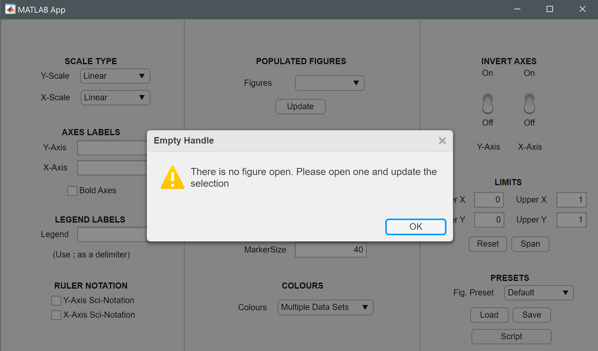
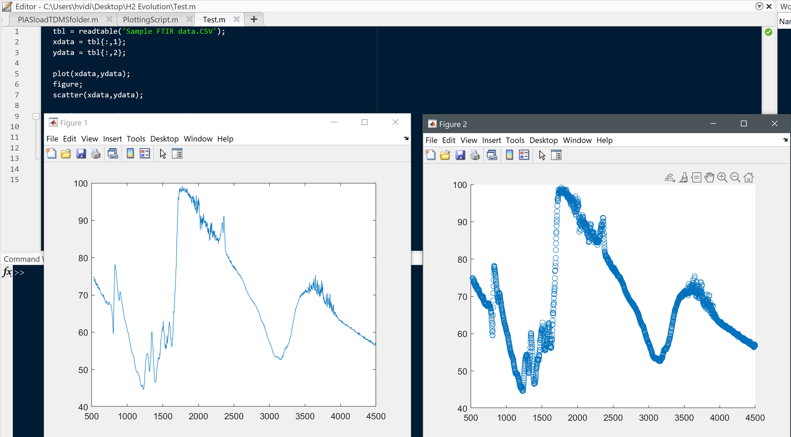
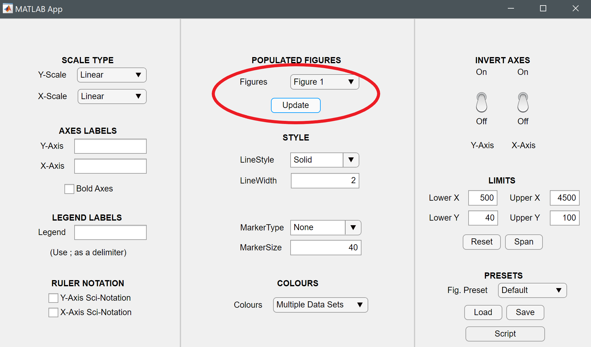

<div id="top"></div>

<!-- PROJECT SHIELDS -->
[![Contributors][contributors-shield]][contributors-url]
[![Forks][forks-shield]][forks-url]
[![Stargazers][stars-shield]][stars-url]
[![Issues][issues-shield]][issues-url]
[![MIT License][license-shield]][license-url]
[![LinkedIn][linkedin-shield]][linkedin-url]


<!-- PROJECT LOGO -->
<br />
<div align="center">
  <a href="https://github.com/SolarSpec/OnePanelFig">
    
  </a>

<h3 align="center">OnePanelFig GUI</h3>

  <p align="center">
    A Graphical User Interface 
    <br />
    <a href="https://github.com/SolarSpec/OnePanelFig"><strong>Explore the docs »</strong></a>
    <br />
    <br />
    <a href="https://github.com/SolarSpec/OnePanelFig">View Demo</a>
    ·
    <a href="https://github.com/SolarSpec/OnePanelFig/issues">Report Bug</a>
    ·
    <a href="https://github.com/SolarSpec/OnePanelFig/issues">Request Feature</a>
  </p>
</div>


<!-- TABLE OF CONTENTS -->
<details>
  <summary>Table of Contents</summary>
  <ol>
    <li>
      <a href="#about-the-project">About The Project</a>
      <ul>
        <li><a href="#built-with">Built With</a></li>
      </ul>
    </li>
    <li>
      <a href="#getting-started">Getting Started</a>
      <ul>
        <li><a href="#prerequisites">Prerequisites</a></li>
        <li><a href="#installation">Installation</a></li>
      </ul>
    </li>
    <li><a href="#usage">Usage</a></li>
    <li><a href="#roadmap">Roadmap</a></li>
    <li><a href="#contributing">Contributing</a></li>
    <li><a href="#license">License</a></li>
    <li><a href="#contact">Contact</a></li>
    <li><a href="#acknowledgments">Acknowledgments</a></li>
  </ol>
</details>


<!-- ABOUT THE PROJECT -->
## About The Project

[![OnePanelFig Screenshot][product-screenshot]](https://solarspec.ok.ubc.ca/)
Format basic properties of your plots through our GUI
<p align="right">(<a href="#top">back to top</a>)</p>


### Built With

* [MATLAB](https://www.mathworks.com/products/matlab.html)
* [Image Processing Toolbox](https://www.mathworks.com/help/images/)
<p align="right">(<a href="#top">back to top</a>)</p>


<!-- GETTING STARTED -->
## Getting Started

To begin using this app is very simple. Just verify you have the necessary prequisites and follow the installation instructions.

### Prerequisites

Make sure MATLAB is installed. It is available for download in the Software Distribution section under the Help tab after you log into [Canvas.](https://canvas.ubc.ca/)
Click on the "Add-Ons" dropdown menu of your MATLAB Home screen. Then click on "Manage Add-Ons" and ensure you have the 'Image Processing Toolbox.' If not, click on "Get Add-Ons" button instead and search for the aforementioned products.

### Installation

1. Clone the repo to your PC
   ```sh
   git clone https://github.com/SolarSpec/OnePanelFig.git
   ```
2. Install the application 
   ```
   Click on the .mlappinstall file in your repository to open and install in MATLAB
   ```
3. Browse the APPS header
   ```
   You will find the recently installed application and can add it to your favourites
   ```

<p align="right">(<a href="#top">back to top</a>)</p>


<!-- USAGE EXAMPLES -->
## Usage

Here is a simple example of the app being used for a line and scatter plot. We start off with no plots and we are instructed to open our figures and then update the app configuration. First we plot our sample data and then press the "Update" button on the GUI.

_Please note that the app will automatically update the GUI when one of your figures is closed but it needs to be updated manually each time a figure is created._

  <figure>
    
    <figcaption> Figure 1: Boot the application </figcaption>
  </figure>
  <figure>
    
    <figcaption> Figure 2: Plot your data </figcaption>
  </figure>
  <figure>
    
    <figcaption> Figure 3: Update your GUI with the update buton</figcaption>
  </figure>

_For more information on any of the internal functions, please refer to the [MATLAB Documentation](https://www.mathworks.com/help/matlab/)_

<p align="right">(<a href="#top">back to top</a>)</p>


<!-- ROADMAP -->
## Roadmap

- [X] Format axes to a standard
- [X] Change aspect ratios to certain useful presets
- [X] Find multiple open figures and update once one closes
- [X] Added special close request to update available figures after one close
  - [ ] Could somehow find a way to auto update when new figures are plotted
- [X] Format styling
- [X] Save configuration of settings to some preset file to load later

See the [open issues](https://github.com/SolarSpec/OnePanelFig/issues) for a full list of proposed features (and known issues).

<p align="right">(<a href="#top">back to top</a>)</p>


<!-- CONTRIBUTING -->
## Contributing

Contributions are what make the open source community such an amazing place to learn, inspire, and create. Any contributions you make are **greatly appreciated**.

If you have a suggestion that would make this better, please fork the repo and create a pull request. You can also simply open an issue with the tag "enhancement".
Don't forget to give the project a star! Thanks again!

1. Fork the Project
2. Create your Feature Branch (`git checkout -b feature/AmazingFeature`)
3. Commit your Changes (`git commit -m 'Add some AmazingFeature'`)
4. Push to the Branch (`git push origin feature/AmazingFeature`)
5. Open a Pull Request

<p align="right">(<a href="#top">back to top</a>)</p>


<!-- LICENSE -->
## License

Distributed under the BSD 3-Clause License. See `LICENSE.txt` for more information.

<p align="right">(<a href="#top">back to top</a>)</p>


<!-- CONTACT -->
## Contact

SolarSpec - [SolarSpec Website](https://solarspec.ok.ubc.ca/) - vidihari@student.ubc.ca

Project Link: [https://github.com/SolarSpec/OnePanelFig](https://github.com/SolarSpec/OnePanelFig)

<p align="right">(<a href="#top">back to top</a>)</p>


<!-- ACKNOWLEDGMENTS -->
## Acknowledgments

* [Group Leader - Dr. Robert Godin](https://solarspec.ok.ubc.ca/people/)
* [Group Alumni - James Kivai](https://solarspec.ok.ubc.ca/people/)
* [The Entire SolarSpec Team](https://solarspec.ok.ubc.ca/people/)

<p align="right">(<a href="#top">back to top</a>)</p>


<!-- MARKDOWN LINKS & IMAGES -->
<!-- https://www.markdownguide.org/basic-syntax/#reference-style-links -->
[contributors-shield]: https://img.shields.io/github/contributors/SolarSpec/OnePanelFig.svg?style=for-the-badge
[contributors-url]: https://github.com/SolarSpec/OnePanelFig/graphs/contributors
[forks-shield]: https://img.shields.io/github/forks/SolarSpec/OnePanelFig.svg?style=for-the-badge
[forks-url]: https://github.com/SolarSpec/OnePanelFig/network/members
[stars-shield]: https://img.shields.io/github/stars/SolarSpec/OnePanelFig.svg?style=for-the-badge
[stars-url]: https://github.com/SolarSpec/OnePanelFig/stargazers
[issues-shield]: https://img.shields.io/github/issues/SolarSpec/OnePanelFig.svg?style=for-the-badge
[issues-url]: https://github.com/SolarSpec/OnePanelFig/issues
[license-shield]: https://img.shields.io/github/license/SolarSpec/OnePanelFig.svg?style=for-the-badge
[license-url]: https://github.com/SolarSpec/OnePanelFig/blob/main/LICENSE
[linkedin-shield]: https://img.shields.io/badge/-LinkedIn-black.svg?style=for-the-badge&logo=linkedin&colorB=555
[linkedin-url]: https://linkedin.com/in/haris-vidimlic-06730019b/
[product-screenshot]: OnePanelFig_resources/Screenshot.png